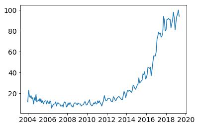
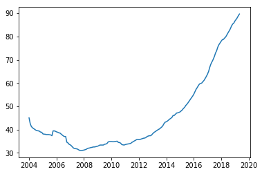
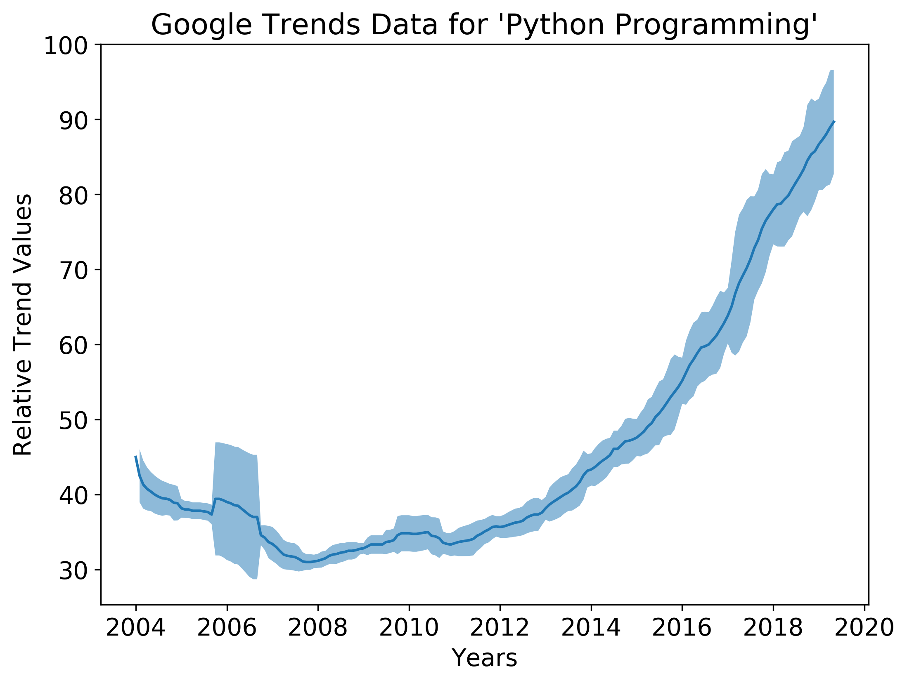
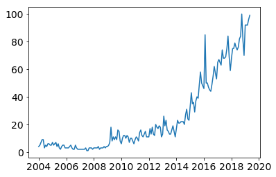
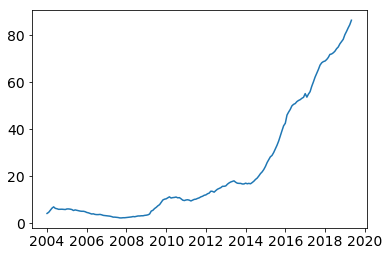
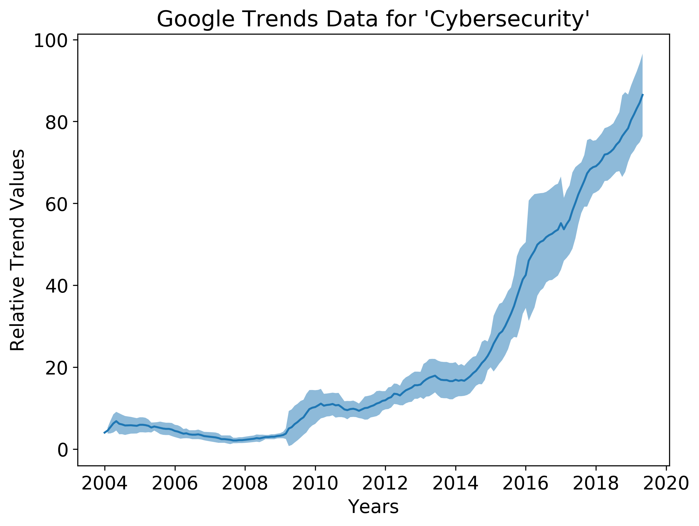
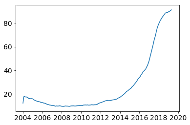
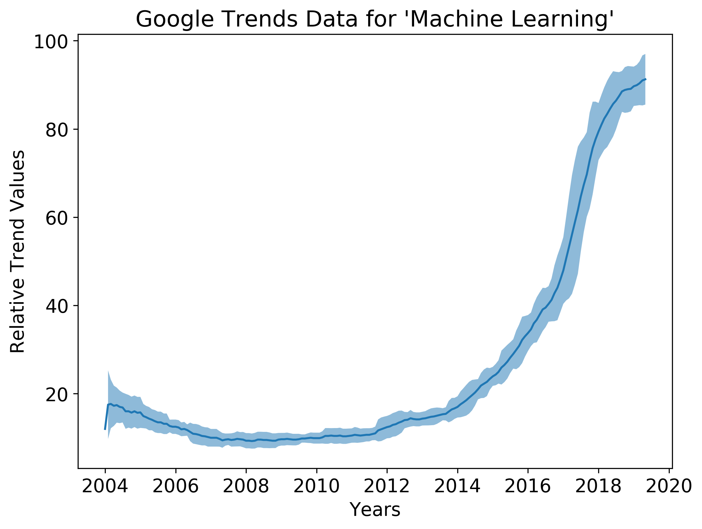

```python
import pandas as pd
import matplotlib.pyplot as plt
from pandas.plotting import register_matplotlib_converters
register_matplotlib_converters()
```

## Python Google Trends Data


```python
python = pd.read_csv("python_trends.csv", skiprows=2, parse_dates=['Month'], index_col=['Month'])
```


```python
python.head()
```


<div>
<style scoped>
    .dataframe tbody tr th:only-of-type {
        vertical-align: middle;
    }

    .dataframe tbody tr th {
        vertical-align: top;
    }

    .dataframe thead th {
        text-align: right;
    }
</style>
<table border="1" class="dataframe">
  <thead>
    <tr style="text-align: right;">
      <th></th>
      <th>Python: (United States)</th>
    </tr>
    <tr>
      <th>Month</th>
      <th></th>
    </tr>
  </thead>
  <tbody>
    <tr>
      <th>2004-01-01</th>
      <td>45</td>
    </tr>
    <tr>
      <th>2004-02-01</th>
      <td>40</td>
    </tr>
    <tr>
      <th>2004-03-01</th>
      <td>39</td>
    </tr>
    <tr>
      <th>2004-04-01</th>
      <td>39</td>
    </tr>
    <tr>
      <th>2004-05-01</th>
      <td>39</td>
    </tr>
  </tbody>
</table>
</div>


```python
plt.plot(python)
```


    [<matplotlib.lines.Line2D at 0x7f3ffcb55438>]





```python
y_mean = python.rolling('365D').mean()

plt.plot(y_mean)
```


    [<matplotlib.lines.Line2D at 0x7f4001d39048>]





```python
y_std = python.rolling('365D').std()

fig = plt.figure(figsize=(8,6), dpi=300)

plt.rc("font",size=14)

plt.ylabel("Relative Trend Values")
plt.xlabel("Years")
plt.title("Google Trends Data for 'Python Programming'")

plt.plot(y_mean)

plt.fill_between(y_mean.index,

                 (y_mean - y_std).values.T[0],

                 (y_mean + y_std).values.T[0], alpha=.5)
fig.savefig("python.png")
```





## Cybersecurity Google Trends Data


```python
python = pd.read_csv("cybersecurity_trends.csv", skiprows=2, parse_dates=['Month'], index_col=['Month'])
```


```python
python.head()
```


<div>
<style scoped>
    .dataframe tbody tr th:only-of-type {
        vertical-align: middle;
    }

    .dataframe tbody tr th {
        vertical-align: top;
    }

    .dataframe thead th {
        text-align: right;
    }
</style>
<table border="1" class="dataframe">
  <thead>
    <tr style="text-align: right;">
      <th></th>
      <th>cybersecurity: (United States)</th>
    </tr>
    <tr>
      <th>Month</th>
      <th></th>
    </tr>
  </thead>
  <tbody>
    <tr>
      <th>2004-01-01</th>
      <td>4</td>
    </tr>
    <tr>
      <th>2004-02-01</th>
      <td>5</td>
    </tr>
    <tr>
      <th>2004-03-01</th>
      <td>7</td>
    </tr>
    <tr>
      <th>2004-04-01</th>
      <td>9</td>
    </tr>
    <tr>
      <th>2004-05-01</th>
      <td>9</td>
    </tr>
  </tbody>
</table>
</div>


```python
plt.plot(python)
```


    [<matplotlib.lines.Line2D at 0x7f3ffcba1c88>]





```python
y_mean = python.rolling('365D').mean()

plt.plot(y_mean)
```


    [<matplotlib.lines.Line2D at 0x7f3ffb559898>]





```python
y_std = python.rolling('365D').std()

fig = plt.figure(figsize=(8,6), dpi=300)

plt.rc("font",size=14)

plt.ylabel("Relative Trend Values")
plt.xlabel("Years")
plt.title("Google Trends Data for 'Cybersecurity'")

plt.plot(y_mean)

plt.fill_between(y_mean.index,

                 (y_mean - y_std).values.T[0],

                 (y_mean + y_std).values.T[0], alpha=.5)
fig.savefig("cybersecurity.png")
```





## Machine Learning Google Trends Data


```python
python = pd.read_csv("machine_learning_trends.csv", skiprows=2, parse_dates=['Month'], index_col=['Month'])
```


```python
python.head()
```


<div>
<style scoped>
    .dataframe tbody tr th:only-of-type {
        vertical-align: middle;
    }

    .dataframe tbody tr th {
        vertical-align: top;
    }

    .dataframe thead th {
        text-align: right;
    }
</style>
<table border="1" class="dataframe">
  <thead>
    <tr style="text-align: right;">
      <th></th>
      <th>machine learning: (United States)</th>
    </tr>
    <tr>
      <th>Month</th>
      <th></th>
    </tr>
  </thead>
  <tbody>
    <tr>
      <th>2004-01-01</th>
      <td>12</td>
    </tr>
    <tr>
      <th>2004-02-01</th>
      <td>23</td>
    </tr>
    <tr>
      <th>2004-03-01</th>
      <td>18</td>
    </tr>
    <tr>
      <th>2004-04-01</th>
      <td>16</td>
    </tr>
    <tr>
      <th>2004-05-01</th>
      <td>18</td>
    </tr>
  </tbody>
</table>
</div>


```python
plt.plot(python)
```


    [<matplotlib.lines.Line2D at 0x7f3ffb49f320>]


```python
y_mean = python.rolling('365D').mean()

plt.plot(y_mean)
```


    [<matplotlib.lines.Line2D at 0x7f4001da5048>]





```python
y_std = python.rolling('365D').std()

fig = plt.figure(figsize=(8,6), dpi=300)

plt.rc("font",size=14)

plt.ylabel("Relative Trend Values")
plt.xlabel("Years")
plt.title("Google Trends Data for 'Machine Learning'")

plt.plot(y_mean)

plt.fill_between(y_mean.index,

                 (y_mean - y_std).values.T[0],

                 (y_mean + y_std).values.T[0], alpha=.5)
fig.savefig("machine_learning.png")
```




